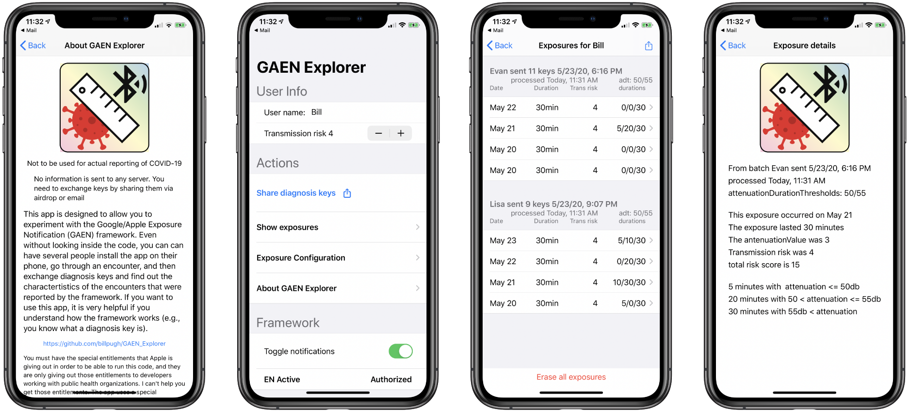
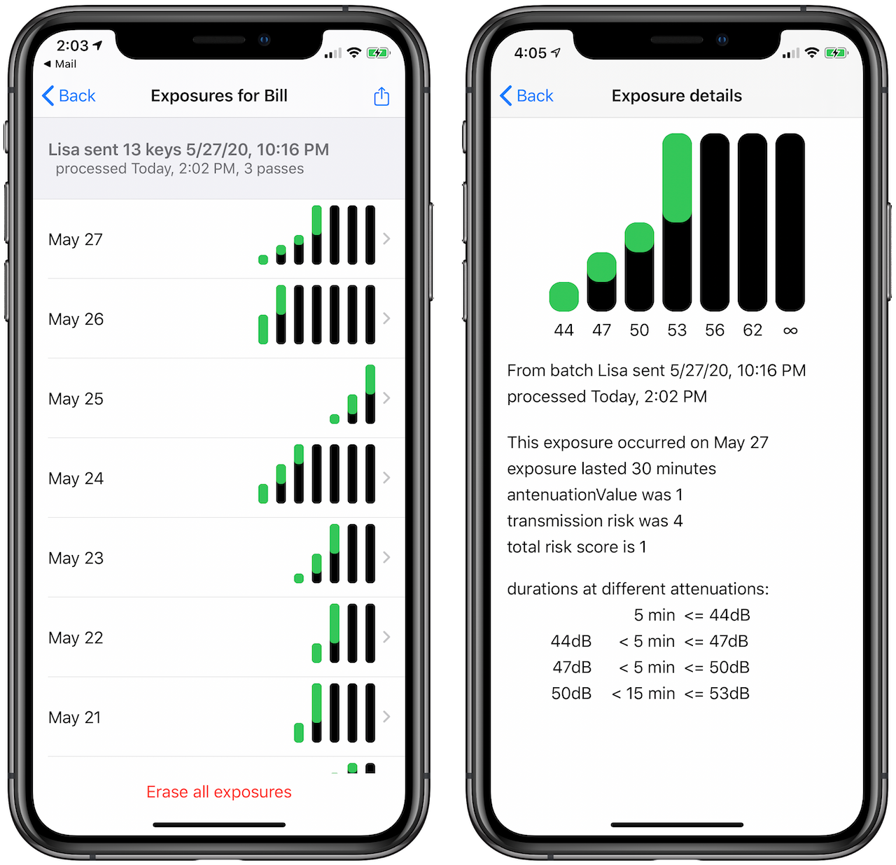

# GAEN Explorer

Note: this is way out of date

This README is a week or two out of date; things move fast. I will try to get it updated in the next week. The screen shots are out of date.  GAEN Explorer has been refocused so that
rather than being a tool used to explore how the framework works, it is now  a research tool designed to allow detailed examination of the encounters detected by the GAEN framework. This allows GAEN Explorer to be used for determining appropriate attenuation thresholds, and estimating false positives and false negatives for detections of epidemiologically significant exposures.

[Here is a detailed presentation on GAEN Explorer.][1] This presentation is directed at an audience that is already familiar with the GAEN framework, and is familiar with terms such as diagnosis keys and rolling proximity identifiers. I hope to have a presentation for a more general audience available shortly

---

This is code I wrote to explore and experiment with the Google+Apple Exposure Notification (GAEN) framework. It is intended to show how the framework can actually be invoked, and to testing of how the exposure detection system works. It is also the first non-trivial app I wrote in Swift. GAEN Explorer is undergoing rapid change and an evolving purpose, see the [Change log][2] for major changes and milestones. Pictures below may be from an early version of GAEN.

 

GAEN Explorer is moving away from something to just figure out how the code works, and moving towards becoming a tool that allows for field experiments about how encounters between people are detected by the framework. This is intended both for very controlled studies where you measure the signal attenuation between two devices place X feet apart, and for field studies, where you might record the encounters detected among a group of people as they carry out their day. The [DP3T - Exposure Score Calculation][3] is a good version of the former; it is definitely worth reading, and others should try to replicate it. The screenshot below shows the display of histograms of encounters with another person.

 

I wrote the app for several reasons: 
* Initially, it was written to allow me to figure out the details of how things such as ENExposureInfo.attenuationvalue  is computed, which isn’t entirely clear from the documentation. As I’ve figured that out, functionality intended for that purpose is being removed 
* To allow me to do experiments where I could put two iPhones a specific distance apart for 20 minutes, then have the devices exchange diagnosis keys and see what they reported about the encounter
I also did more general experiments, where I installed the app on all of the iPhones in my household, and then exchanged keys every day to see who was reported as having close encounters with each other, and how that corresponded to our actual encounters. My kids were finishing up their college semester at home, and there were days when they were in crunch mode and we barely saw them
* Eventually, to be able to use TestFlight, or some distribution outside of the app store, to distribute it to public health authorities, researchers and journalists to allow them to independently conduct experiments of the effectiveness of the GAEN framework.

This app is not intended for use in alerting anyone to a diagnosis of COVID-19.

Rather than allowing people to report that they have been diagnosed with COVID-19 and having diagnosis keys distributed by a diagnosis key service, the system allows diagnosis keys to be shared between two devices by email or airdrop. When the keys are received, they are immediately processed and the exposes are recorded. 

You must have the special entitlements that Apple is giving out in order to be able to run this code, and they are only giving out those entitlements to developers working with public health organizations. Several important notes:
* I can't help you get those entitlements. 
* The app uses a special entitlement that allows it to get the diagnosis key for the current day.
* The encounter notification framework will only run on actual devices, not in the simulator. 

Some code was taken from the sample Encounter Notification app [provided by Apple][4], in particular the code for computing the signing files for the keys. 

[1]:	https://docs.google.com/presentation/d/19iW7vFzj-LInUZUpXYh4jZOlLH0-a7Jo4cjHy4bJf6o/edit?usp=sharing
[2]:	CHANGES.md
[3]:	https://github.com/DP-3T/documents/blob/master/DP3T%20-%20Exposure%20Score%20Calculation.pdf
[4]:	https://developer.apple.com/documentation/exposurenotification/building_an_app_to_notify_users_of_covid-19_exposure
